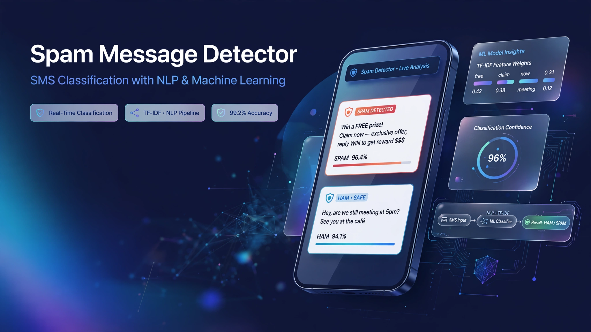

  

<h1 align="center">📩 Spam Message Detector</h1>

  <strong>SMS spam classification using NLP and Machine Learning.</strong>

  
  
  
  

  <a href="https://github.com/Yassir050/Spam-Message-Detector">💻 Repository</a>

⸻

📖 Overview

Spam Message Detector is a machine learning project that classifies SMS messages as Spam or Ham (legitimate) using Natural Language Processing (NLP) and supervised machine learning.

The project uses the SMS Spam Collection dataset from the UCI Machine Learning Repository.

The goal is to build a clean and reproducible machine learning pipeline covering data preprocessing, text vectorization, model training, evaluation, and model persistence.

⸻

✨ Features

* 📩 SMS spam detection
* 📝 Natural Language Processing (NLP)
* 🔤 TF-IDF text vectorization
* 🤖 Logistic Regression classification
* 📊 Model evaluation
* 💾 Model persistence with Joblib
* 🧹 Data cleaning and duplicate removal
* 🛡️ Train/test data splitting
* ⚙️ Automated training with GitHub Actions

⸻

🛠️ Technologies

Technology	Purpose
Python 3	Programming language
Pandas	Data loading and preprocessing
Scikit-learn	Machine learning and evaluation
TF-IDF	Text feature extraction
Logistic Regression	SMS classification
Joblib	Model persistence
Git	Version control
GitHub	Source code hosting
GitHub Actions	Automated workflow

⸻

📊 Dataset

This project uses the SMS Spam Collection dataset from the UCI Machine Learning Repository.

The dataset contains SMS messages labeled as:

* ham — legitimate message
* spam — unwanted message

Dataset source:

UCI Machine Learning Repository — SMS Spam Collection

⸻

📁 Project Structure

Spam-Message-Detector/
├── assets/
│   └── spam-detector-banner.png
│
├── data/
│   └── SMSSpamCollection
│
├── src/
│   ├── preprocess.py
│   └── train.py
│
├── models/
│
├── .github/
│   └── workflows/
│       └── train.yml
│
├── README.md
├── requirements.txt
└── .gitignore

Files

* SMSSpamCollection — SMS dataset.
* preprocess.py — Loads and cleans the dataset.
* train.py — Trains and evaluates the machine learning model.
* models/ — Stores the trained model locally.
* requirements.txt — Project dependencies.
* .github/workflows/ — GitHub Actions automation.
* .gitignore — Prevents unnecessary and generated files from being committed.

⸻

⚙️ How It Works

The machine learning pipeline is:

SMS Message
     ↓
Data Loading
     ↓
Data Cleaning
     ↓
Train/Test Split
     ↓
TF-IDF Vectorization
     ↓
Logistic Regression
     ↓
Model Evaluation
     ↓
Saved Model

1. Data Loading

The dataset is loaded using Pandas and separated into:

* Message text
* Message label

2. Data Cleaning

The preprocessing stage:

* Removes missing values
* Removes duplicate messages
* Prepares the data for machine learning

3. Train/Test Split

The dataset is divided into training and testing sets.

A stratified split is used to maintain the class distribution between the two sets.

4. TF-IDF Vectorization

TF-IDF (Term Frequency–Inverse Document Frequency) converts SMS text into numerical features that can be processed by a machine learning model.

The vectorizer is fitted only on the training data and then used to transform the test data.

5. Model Training

A Logistic Regression classifier is trained using the TF-IDF features.

6. Evaluation

The model is evaluated using:

* Accuracy
* Precision
* Recall
* F1-score

7. Model Persistence

The trained model and TF-IDF vectorizer are saved using Joblib.

models/spam_model.pkl

⸻

🚀 Installation

1. Clone the repository

git clone https://github.com/Yassir050/Spam-Message-Detector.git

2. Enter the project directory

cd Spam-Message-Detector

3. Install dependencies

pip install -r requirements.txt

⸻

▶️ Train the Model

Run:

python src/train.py

The program will:

1. Load the dataset.
2. Clean the data.
3. Split the dataset.
4. Convert messages into TF-IDF features.
5. Train the Logistic Regression model.
6. Evaluate the model.
7. Save the trained model locally.

The trained model will be saved as:

models/spam_model.pkl

⸻

📈 Example Output

Training completed!
Accuracy: XX.XX%
Classification Report:
              precision    recall    f1-score
ham             ...
spam            ...
Model saved to: models/spam_model.pkl

The exact evaluation results may vary depending on the dataset and model configuration.

⸻

⚙️ GitHub Actions

The repository includes a GitHub Actions workflow that automatically:

1. Checks out the repository.
2. Sets up Python.
3. Installs project dependencies.
4. Runs the training pipeline.

This helps make the project more reproducible and demonstrates basic CI/CD workflow experience.

⸻

🧠 Skills Practiced

This project demonstrates practical experience with:

* Python
* Pandas
* Data preprocessing
* Natural Language Processing
* TF-IDF
* Text classification
* Logistic Regression
* Train/test splitting
* Model evaluation
* Model persistence
* Git & GitHub
* GitHub Actions
* Reproducible ML workflows

⸻

🎯 Project Goal

The goal of this project is to build practical experience in Machine Learning and NLP while developing a clean and organized machine learning repository.

This project is part of my learning path toward AI Engineering.

⸻

👨‍💻 Author

Yassir.B

GitHub:

https://github.com/Yassir050
